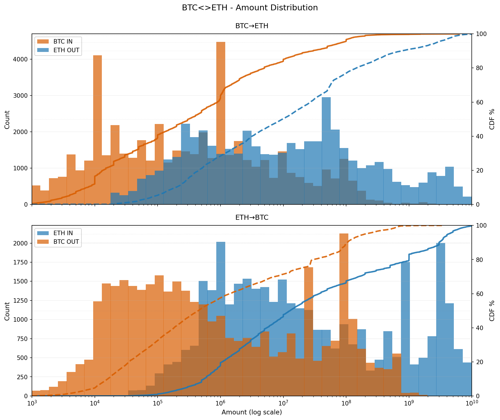
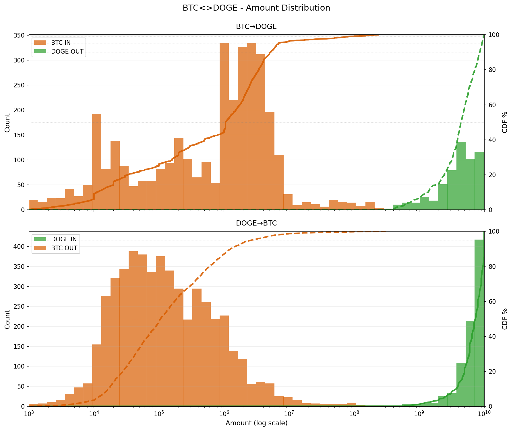
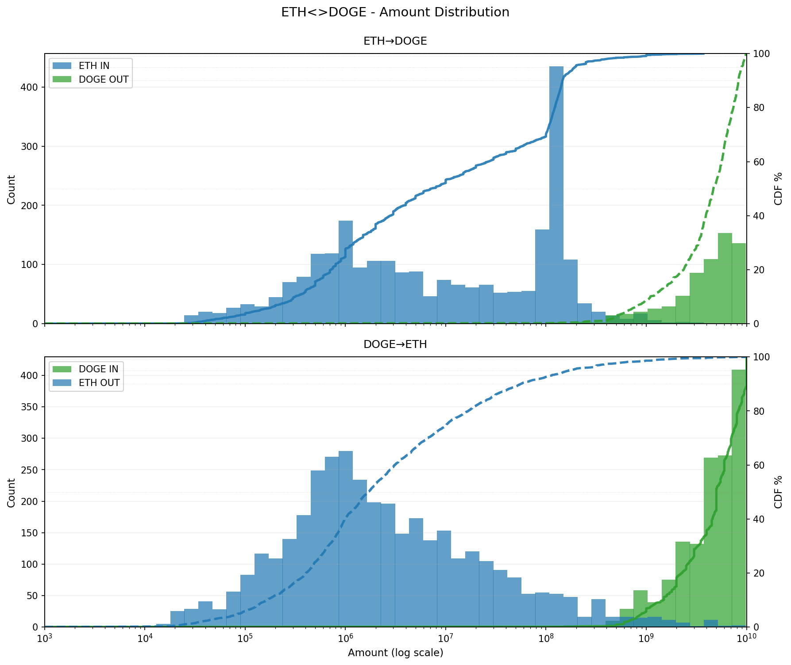

# THORChain Crosschain Data

## About THORChain

[THORChain](https://thorchain.org/) is a decentralized cross-chain liquidity protocol built as an independent Layer 1 blockchain using Cosmos SDK. It enables native asset swaps across different blockchains without wrapped tokens or centralized custodians. The THORChain network produces blocks approximately every 6 seconds ([docs](https://docs.thorchain.org/)).

## Data Selection

THORChain supports cross-chain swaps across many blockchains (BTC, ETH, BSC, AVAX, DOGE, LTC, BCH, etc.) and various assets (native coins, ERC-20 tokens, BEP-20 tokens, etc.).

**This dataset focuses on:**
- **Chains**: BTC, ETH, DOGE (3 common chains)
- **Assets**: Native assets only (BTC, ETH, DOGE)
- **Filter**: `type=swap` and `status=success` records only

## Dataset Naming Convention

**Format**: `thorchain-2025-<condition1>-<condition2>` (Short: `Thor25<C1><C2>`)

**Amount**: `L` (Low) | `H` (High) | `X` (eXtra)
**Time**: `F` (Fast) | `S` (Slow)

**Current datasets**:
- `thorchain-2025` (Thor25): Full 2025 dataset (102,657 standard 1-in-1-out swaps)
- `thorchain-2025-high-fast` (Thor25HF): High amount (0.1 BTC / 2 ETH / 1k DOGE) + Fast completion (≤30min, 13,223 records)
- `thorchain-2025-high-fast-mini` (Thor25HF-mini): Mini test set sampled from HF (60 records, 10 per pair)
- `thorchain-2025-multi` (Thor25M): Multi-output swaps (156 records, currently not used for queries)

## Quick Start

Query files are not included in the repository (they're generated from the source data). Generate them locally:

```bash
# Generate queries for mini test set (60 queries, recommended for first try)
uv run python script/process/gen_query.py --batch --input-dir data/thorchain-2025-high-fast-mini --output-dir queries/thorchain-2025-high-fast-mini

# Generate queries for high-fast dataset (13k queries)
uv run python script/process/gen_query.py --batch --input-dir data/thorchain-2025-high-fast --output-dir queries/thorchain-2025-high-fast

# Generate queries for full dataset (103k queries)
uv run python script/process/gen_query.py --batch --input-dir data/thorchain-2025 --output-dir queries/thorchain-2025
```

Then use with BlockchainMAS:
```bash
cd /path/to/BlockchainMAS
python -m src.main --batch data/thorchain/queries/thorchain-2025-high-fast-mini/BTC-ETH.yaml
```

## Data Characteristics

### Overview
- **Time Range**: 2025-01-01 00:00:00 UTC ~ 2025-12-31 23:59:59 UTC (full year)
- **Total Records**: 102,657 successful swaps across 6 pair files + 156 multi-out
- **Pairs**: BTC<>ETH, BTC<>DOGE, ETH<>DOGE (both directions)

### Amount Unit Normalization
THORChain Midgard API normalizes all asset amounts to **1e8 base units** (similar to Bitcoin's satoshi), regardless of the native blockchain's decimal precision ([Midgard docs](https://docs.thorchain.org/technical-documentation/technology/midgard)):
- **ETH** (native 1e18 wei) → shortened to **1e8**
- **BTC** (native 1e8 satoshi) → preserved as **1e8**
- **DOGE** (native 1e8) → preserved as **1e8**

This means: `1 BTC = 1 ETH = 1 DOGE = 100,000,000 units` in the data.

### Timestamp Format
All timestamps in Midgard API are **Unix timestamps in UTC timezone**, with the `date` field in nanoseconds ([API spec](https://midgard.ninerealms.com/v2/swagger.json)).

### Transaction Count by Direction
- **BTC→ETH**: 50,597 records (49.3%)
- **ETH→BTC**: 37,087 records (36.1%)
- **BTC→DOGE**: 3,482 records (3.4%)
- **DOGE→BTC**: 5,149 records (5.0%)
- **ETH→DOGE**: 2,560 records (2.5%)
- **DOGE→ETH**: 3,782 records (3.7%)

### Daily Distribution


### Amount Distribution
- Amount ranges span multiple orders of magnitude (10³ to 10¹⁰)
- Each asset shows distinct distribution patterns
- IN (solid) vs OUT (dashed) amounts show swap behavior

| Pair      | Distribution Plot                                             |
| --------- | ------------------------------------------------------------- |
| BTC<>ETH  |    |
| BTC<>DOGE |  |
| ETH<>DOGE |  |

### Height Diff (Swap Completion Time)
- Most swaps complete quickly: median 6-26 thorchain blocks depending on pair
- ~80-90% complete within 100 blocks
- ~99%+ complete within 1000 blocks
- Outliers exist up to 24k blocks (ETH→BTC)


### Traffic Spikes
- 2025-02-22~03-03: Major spike in ETH→BTC (~10 days, tx count surged from ~100/day to 1000-2000/day, daily amount jumped from ~100 ETH to 20,000-85,000 ETH), related to **Bybit hack** fund flows
- 2025-03-14~15: Abnormal spike in BTC<>ETH (1800+ tx/day, height diff up to 5000+ blocks)
- 2025-06: Another spike (~1100 tx/day, height diff up to 3000+ blocks)


## Scripts

### crawl/ - Fetching Raw Data and Reprocessing

#### fetch_swaps.py
Midgard API crawler (backwards by timestamp) for THORChain swap actions.

- `--min-ts`: Lower bound Unix timestamp, stop when reaching this
- `--max-ts`: Upper bound Unix timestamp, start from here
- `--fresh`: Start a new crawl from scratch
- `--resume`: Continue from last saved state

```bash
# Fresh crawl
uv run python script/crawl/fetch_swaps.py --outdir raw --min-ts 1735689600 --fresh

# Resume
uv run python script/crawl/fetch_swaps.py --outdir raw --min-ts 1735689600 --resume
```

#### wash.py
Transform raw data to cleaned format. Filters `status != 'success'` records and removes `THOR.*` assets (e.g., THOR.RUNE affiliate fees) from outputs to keep only the actual swap assets.

**Record ID**: `id = SHA-256("\n".join(sorted(entries)) + "\n{type}|{status}")` where each entry = `"{direction}|{chain}|{asset}|{address}|{txID}"` (auto-deduplicated). This derived ID appears as `query_id` in generated query files.

```bash
uv run python script/crawl/wash.py --indir raw/data --outdir data/thorchain-2025
```

### process/ - Data Processing Pipeline

#### filter_data.py
Filter swap data by amount and time thresholds to create high-quality datasets.

```bash
# Edit thresholds in script, then run:
uv run python script/process/filter_data.py
```

Configuration presets: 0.01%, 0.02%, 0.05%, 0.1% fee rates. See `FILTERING_THRESHOLDS.md` for details.

#### sample_mini.py
Sample mini dataset from high-fast data for testing.

```bash
uv run python script/process/sample_mini.py
```

#### gen_query.py
Generate YAML batch query files from ndjson data.

```bash
# Generate from a single ndjson file
uv run python script/process/gen_query.py --input ../../data/BTC-DOGE.ndjson --output ../../queries/BTC-DOGE.yaml

# Generate from all ndjson files (batch mode)
uv run python script/process/gen_query.py --batch --input-dir ../../data --output-dir ../../queries

# # Optional: Add timestamp_delta metadata (requires blockchain_txs/ directory from enrich/)
# uv run python script/process/gen_query.py --batch --input-dir ../../data --output-dir ../../queries --blockchain-txs-dir ../../blockchain_txs
```

The generated YAML files can be used with BlockchainMAS:
```bash
cd /path/to/BlockchainMAS
python -m src.main --batch data/thorchain/queries/BTC-DOGE.yaml
```

### analyze/ - Tools for Validate and Analyzing Data

#### validate.py
Check for duplicate records by ID.

```bash
uv run python script/analyze/validate.py
```

#### stats.py
Compute per-pair statistics (amounts, height diff, timestamps).

```bash
uv run python script/analyze/stats.py
```

#### plot.py
Plot amount & height diff vs timestamp.

```bash
uv run python script/analyze/plot.py
```

Output: `png/*.png`

#### identify_slow_swaps.py
Identify swaps with abnormally long completion times (for debugging/analysis).

- `-t`: Height diff threshold (records with diff > threshold)
- `-s`: Start date (YYYY-MM-DD)
- `-e`: End date (YYYY-MM-DD)

```bash
# Basic
uv run python script/analyze/identify_slow_swaps.py -t 5000

# With date range
uv run python script/analyze/identify_slow_swaps.py -t 2000 -s 2025-03-01 -e 2025-03-31

# Export JSON
uv run python script/analyze/identify_slow_swaps.py -t 5000 -o results.json
```
