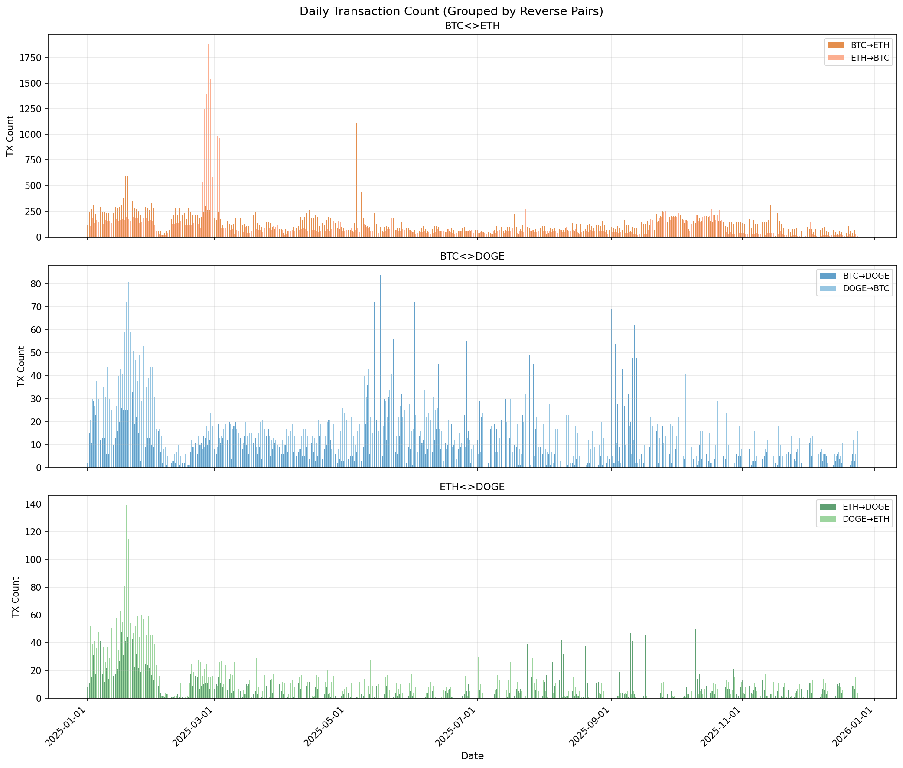
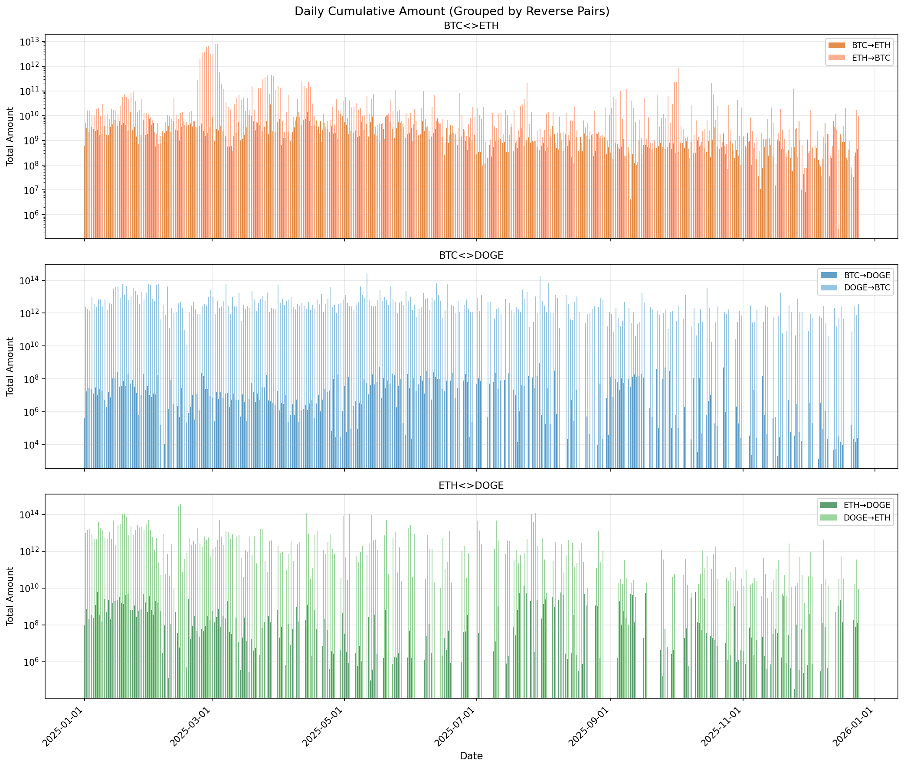
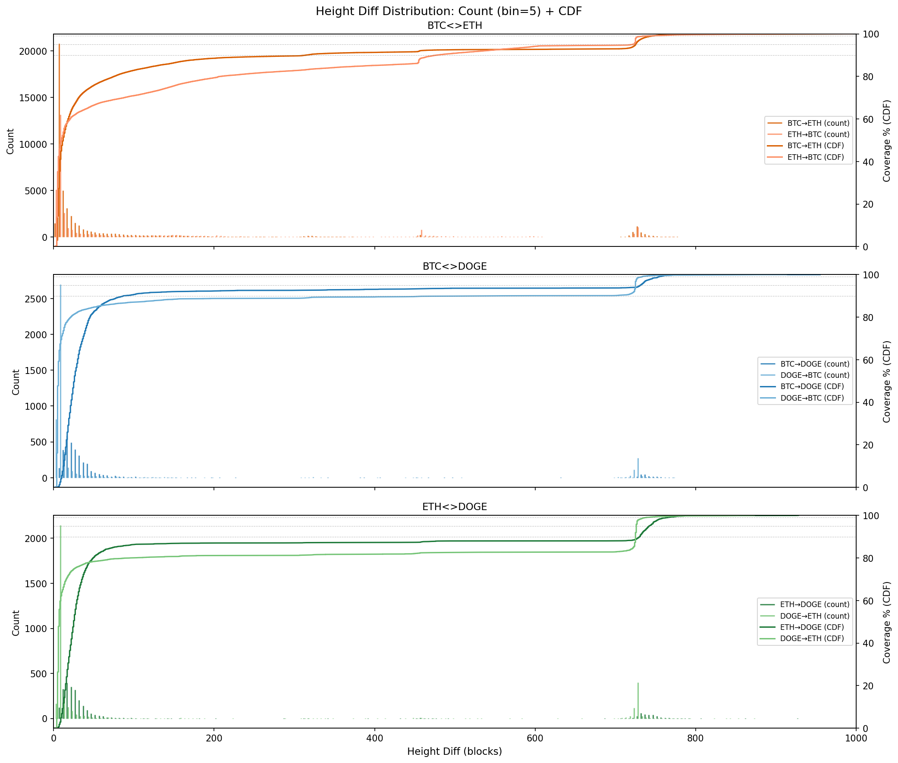
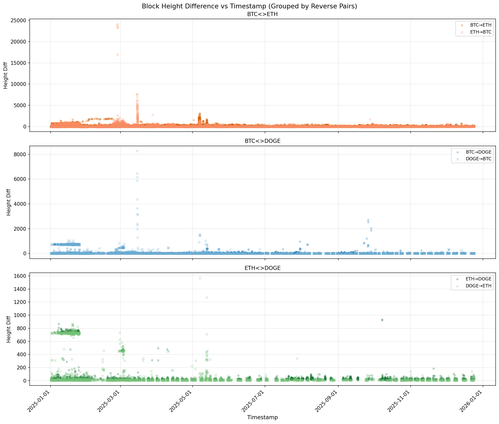

# THORChain Crosschain Data

## About THORChain

[THORChain](https://thorchain.org/) is a decentralized cross-chain liquidity protocol built as an independent Layer 1 blockchain using Cosmos SDK. It enables native asset swaps across different blockchains without wrapped tokens or centralized custodians. The THORChain network produces blocks approximately every 6 seconds ([docs](https://docs.thorchain.org/)).

## Data Selection

THORChain supports cross-chain swaps across many blockchains (BTC, ETH, BSC, AVAX, DOGE, LTC, BCH, etc.) and various assets (native coins, ERC-20 tokens, BEP-20 tokens, etc.).

**This dataset focuses on:**
- **Chains**: BTC, ETH, DOGE (3 common chains)
- **Assets**: Native assets only (BTC, ETH, DOGE)
- **Filter**: `type=swap` and `status=success` records only

## Data Characteristics

### Overview
- **Time Range**: 2025-01-01 ~ 2025-12-25 (1 year)
- **Total Records**: ~101k successful swaps across 6 pair files + 152 multi-out
- **Pairs**: BTC<>ETH, BTC<>DOGE, ETH<>DOGE (both directions)

### Volume Distribution
- BTC<>ETH dominates: ~87k records (86%)
- BTC<>DOGE: ~8.5k records (8%)
- ETH<>DOGE: ~6.2k records (6%)




### Height Diff (Swap Completion Time)
- Most swaps complete quickly: median 6-26 thorchain blocks depending on pair
- ~80-90% complete within 100 blocks
- ~99%+ complete within 1000 blocks
- Outliers exist up to 24k blocks (ETH→BTC)



### Traffic Spikes
- 2025-02-22~03-03: Major spike in ETH→BTC (~10 days, tx count surged from ~100/day to 1000-2000/day, daily amount jumped from ~100 ETH to 20,000-85,000 ETH), related to Bybit hack fund flows
- 2025-03-14~15: Abnormal spike in BTC<>ETH (1800+ tx/day, height diff up to 5000+ blocks)
- 2025-06: Another spike (~1100 tx/day, height diff up to 3000+ blocks)




## Scripts

### crawl/ - Fetching Raw Data and Reprocessing

#### fetch.py
Midgard API crawler (backwards by timestamp).

- `--min-ts`: Lower bound Unix timestamp, stop when reaching this
- `--max-ts`: Upper bound Unix timestamp, start from here
- `--fresh`: Start a new crawl from scratch
- `--resume`: Continue from last saved state

```bash
# Fresh crawl
uv run python script/crawl/fetch.py --outdir raw --min-ts 1735689600 --fresh

# Resume
uv run python script/crawl/fetch.py --outdir raw --min-ts 1735689600 --resume
```

#### wash.py
Transform raw data to cleaned format.

```bash
uv run python script/crawl/wash.py --indir raw/data --outdir data
```

### generate/ - Generate Query Files for BlockchainMAS

#### gen_query.py
Generate YAML batch query files from cleaned ndjson data.

```bash
# Generate from a single ndjson file
uv run python script/generate/gen_query.py --input ../../data/BTC-DOGE.ndjson --output ../../queries/BTC-DOGE.yaml

# Generate from all ndjson files (batch mode)
# Note: Automatically skips multi-* files
uv run python script/generate/gen_query.py --batch --input-dir ../../data --output-dir ../../queries
```

Query template:
```
What is the source transaction for this cross-chain {out.asset} output
to {out.address} in tx {out.txid} on {out.chain},
given that it originates from {in.asset} on {in.chain}?
```

The generated YAML files can be used with BlockchainMAS:
```bash
# Run queries from generated YAML
cd /path/to/BlockchainMAS
python -m src.main --batch data/thorchain/queries/BTC-DOGE.yaml
```

### analyze/ - Tools for Validate and Analyzing Data

#### validate.py
Check for duplicate records by ID.

```bash
uv run python script/analyze/validate.py
```

#### stats.py
Compute per-pair statistics (amounts, height diff, timestamps).

```bash
uv run python script/analyze/stats.py
```

#### plot.py
Plot amount & height diff vs timestamp.

```bash
uv run python script/analyze/plot.py
```

Output: `png/*.png`

#### filter.py (optional)
Filter records by height diff threshold.

- `-t`: Height diff threshold (records with diff > threshold)
- `-s`: Start date (YYYY-MM-DD)
- `-e`: End date (YYYY-MM-DD)

```bash
# Basic
uv run python script/analyze/filter.py -t 5000

# With date range
uv run python script/analyze/filter.py -t 2000 -s 2025-03-01 -e 2025-03-31

# Export JSON
uv run python script/analyze/filter.py -t 5000 -o results.json
```
